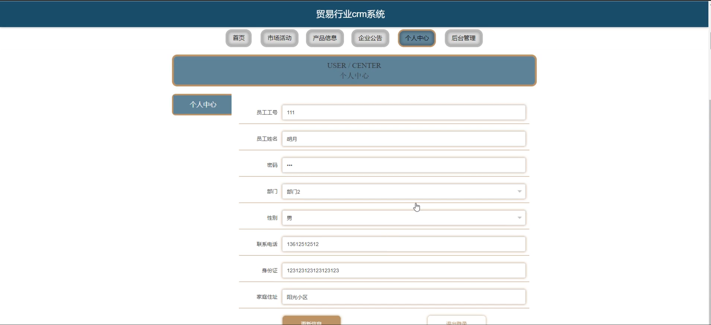
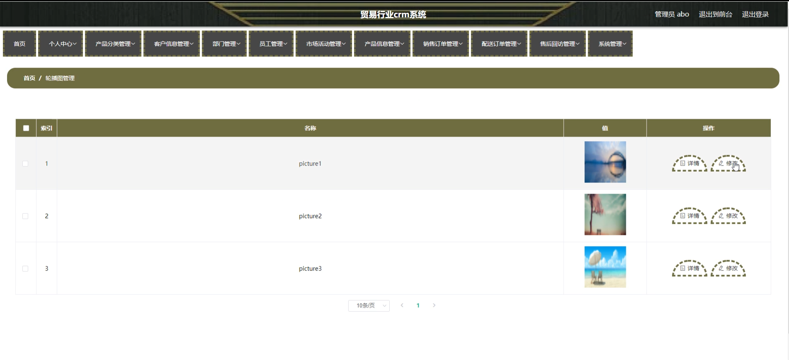
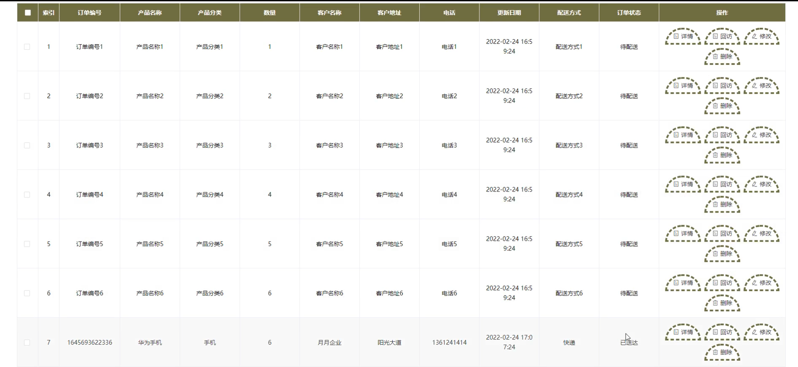

# 基于springboot的贸易行业crm系统

<h4 style='color:red'>联系不到我，就看我的主页 </h4> 
 
#### 介绍

在竞争日益激烈的贸易行业中，有效的客户关系管理对于企业的成功至关重要。为了满足贸易企业对客户关系管理的需求，我们开发了这个基于 Spring Boot 的贸易行业 CRM 系统。该系统旨在帮助企业更好地管理客户、提高销售效率、优化业务流程，并提升客户满意度。

#### 技术栈

后端技术栈：Springboot+Mysql+Maven

前端技术栈：Vue+Html+Css+Javascript+ElementUI

开发工具：Idea+Vscode+Navicate

#### 系统功能介绍

（一）管理员角色  
个人中心：管理员可以在此查看和修改个人信息，如联系方式、密码等，同时接收系统的重要通知和提醒。  
产品分类管理：对企业所经营的产品进行分类，便于后续的产品信息管理和销售分析。例如，将产品分为电子产品、服装、家居用品等类别。  
客户信息管理：全面管理客户的基本信息、联系记录、交易历史等。可以对客户进行分类，如潜在客户、新客户、老客户等，以便制定针对性的营销策略。  
部门管理：设置企业的组织架构，包括创建、修改和删除部门，为员工分配所属部门，明确各部门的职责和权限。  
员工管理：负责员工的信息录入、岗位分配、权限设置等。可以查看员工的工作绩效和业务数据，对员工进行培训和考核管理。  
市场活动管理：策划和组织市场推广活动，如促销活动、展会、线上营销等。可以设定活动目标、预算、执行计划，并跟踪活动效果。  
产品信息管理：详细记录产品的名称、规格、价格、库存等信息。可以对产品进行上下架操作，更新产品描述和图片，确保产品信息的准确性和及时性。  
销售订单管理：处理销售订单的生成、审核、发货、收款等环节。能够实时监控订单状态，及时解决订单处理过程中的问题。  
配送订单管理：管理货物的配送安排，包括选择物流供应商、跟踪配送进度、处理配送异常等，确保货物按时、准确地送达客户手中。  
售后回访管理：安排售后回访工作，收集客户的反馈意见，处理客户的投诉和建议，提升客户的满意度和忠诚度。  
系统管理：对整个 CRM 系统进行配置和维护，包括数据备份与恢复、系统参数设置、用户权限管理等，保障系统的稳定运行和数据安全。  

（二）员工角色  
市场活动：参与市场活动的执行，了解活动的目标和计划，向客户推广企业的产品和服务。  
产品信息：查看产品的详细信息，以便向客户进行准确的介绍和推荐。  
企业公告：及时获取企业内部的重要通知和政策变动，了解公司的最新动态。  
个人中心：修改个人资料，查看自己的工作任务和绩效数据。  
后台管理  
个人中心：同上述个人中心功能。  
客户信息管理：维护自己负责的客户信息，更新客户的跟进状态。  
产品信息管理：协助管理员更新产品信息，确保自己掌握的产品信息准确无误。  
销售订单管理：跟进自己负责的销售订单，及时与客户沟通订单进展。  
配送订单管理：协助处理配送相关的事务，如与客户确认收货地址等。  
售后回访管理：按照安排对客户进行回访，记录回访结果。  

#### 系统作用

贸易行业CRM系统的主要作用包括：  

提升管理效率： 为管理员和员工提供全面的管理工具，帮助高效管理客户信息、市场活动、销售订单、配送订单和售后服务，确保信息的准确性和及时性。  
优化客户关系： 通过系统化的客户信息管理和售后回访，帮助企业更好地了解和服务客户，提升客户满意度和忠诚度。  
促进市场活动： 管理和跟踪市场活动的进展和效果，帮助企业更好地策划和执行市场推广活动，提升市场竞争力。  
提高工作协同： 通过部门和员工管理，明确职责和权限，促进团队协作，提升工作效率。  

#### 系统功能截图

代码结构

数据库表

登录

市场活动

产品信息

企业公告

个人中心

员工端后台管理

管理员端客户信息管理

部门管理

销售订单管理

轮播图管理

产品信息管理

销售订单管理

#### 总结

基于 Spring Boot 的贸易行业 CRM 系统通过为管理员和员工提供丰富的功能模块，实现了对贸易业务的全面管理和优化。管理员能够从宏观层面把控企业的运营方向，合理配置资源；员工能够高效地执行各项业务操作，提升工作效率和服务质量。该系统有助于企业在贸易行业中提升竞争力，实现可持续发展。

#### 使用说明

创建数据库，执行数据库脚本 修改jdbc数据库连接参数 下载安装maven依赖jar 启动idea中的springboot项目

后台地址
http://localhost:8080/springbootl8m1o/admin/dist/index.html

管理员  abo 密码 abo

前台地址：http://localhost:8080/springbootl8m1o/front/index.html